# 🚀 基于RK3576的视频监控客户端

<div align="center">

[](https://www.linux.org/)
[](https://www.qt.io/)
[](https://ffmpeg.org/)
[](LICENSE)

</div>

---

## 📋 项目概述

### 🎯 项目架构

本项目采用**分布式PC-客户端架构**，分为两大部分：

| 部分 | 描述 | 仓库链接 |
|------|------|--------|
| **📸 RV1106终端** | 基于瑞芯微RV1106的网络摄像头终端软件 | [Intelligent_Recognition_Client](https://github.com/Tomorrow-star-618/Intelligent_Recognition_Client) |
| **🖥️ RK3576客户端** | 基于RK3576的视频监控PC客户端 ⭐ **本仓库** | [Linux-QT-RTSP](https://github.com/Tomorrow-star-618/Linux-QT-RTSP) |

### 🌿 分支说明

本仓库包含两个主要分支，满足不同平台需求：

#### `master` 分支 ✅ **推荐用于开发**
- **支持平台**: Windows 10/11、Ubuntu 20.04/22.04
- **特性**: 完整的监控功能，适合通用PC开发和部署
- **用途**: 标准桌面应用开发

#### `rk3576` 分支 🔧 **嵌入式优化专用**
- **目标设备**: 野火鲁班猫3（RK3576开发板）
- **优化项目**:
  - 🎬 多路硬件视频加速 (VPU、RGA 2D加速)
  - 🖼️ Mali-G52 GPU加速渲染
- **兼容性**: 仍支持 Windows 与 Ubuntu 系统
- **关系**: 在 `master` 分支基础上进行二次开发优化

---

## 📑 文档导航

- [✨ 核心功能](#-核心功能)
- [🛠️ 开发环境](#️-开发环境)
- [📚 使用教程](#-使用教程)
- [📈 性能测试](#-性能测试)
- [🏗️ 框架设计](#️-框架设计)
- [📁 项目结构](#-项目结构)
- [🚀 应用场景](#-应用场景)
- [📄 许可证](#-许可证)


## ✨ 核心功能

### 📺 视频流
- **智能双解码**: 分平台自动切换，PC端使用FFmpeg软解，RK3576平台进行硬解
- **MPP硬件解码**: 集成瑞芯微MPP硬件解码，极限降低CPU占用率
- **RGA硬件加速**: 利用RGA 2D引擎和ION零拷贝，实现高效图像格式转换
- **多线程与容错**: 独立线程防UI阻塞，内置断流异常检测与超时自动重连
- **视频流控制**: 实时输出QImage，支持启动/停止/暂停/恢复等操作

<div align="center">

<p><b>实物展示</b></p>
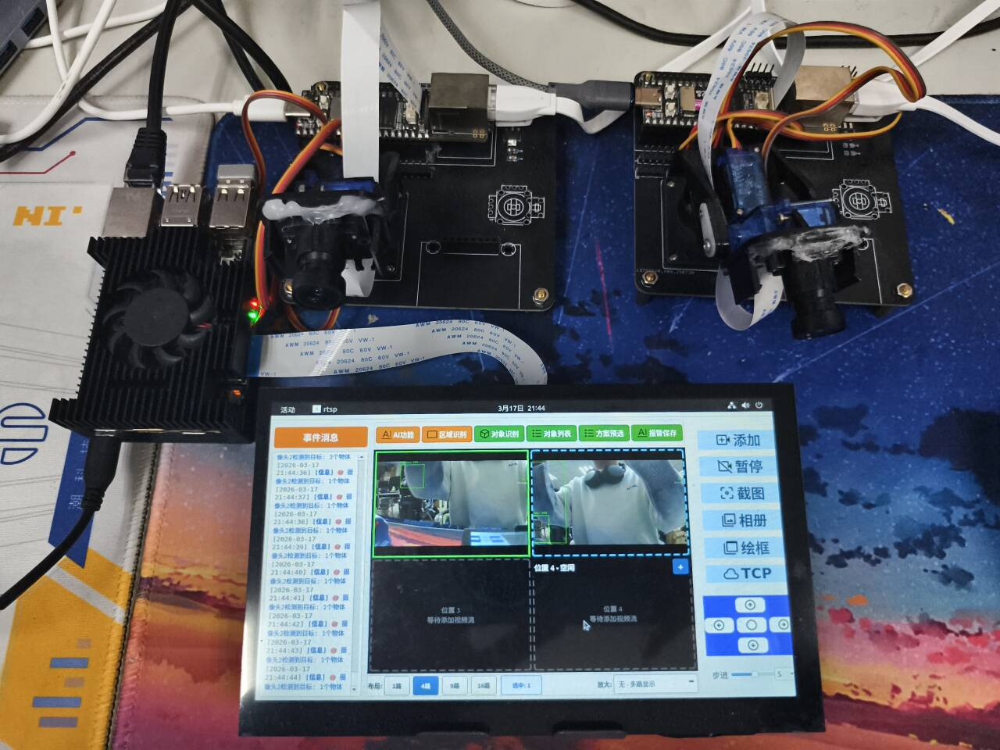


<p><b>视频流拉取展示</b></p>
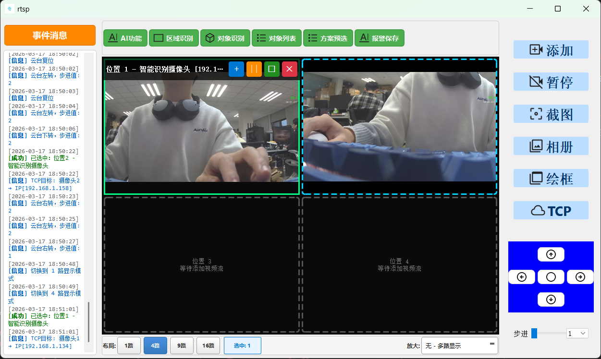

</div>

### 🌐 TCP服务端
- **多客户端支持**: 可同时处理多个客户端连接
- **收发数据**: 可以指定发送任意数据到当前连接上的任意客户端上
- **IP地址管理**: 自动获取本地所有IPv4地址
- **连接状态监控**: 实时监控socket连接状态变化
- **AI数据解析**: 自动解析DETECTIONS格式的检测结果
- **自动绑定机制**: 新TCP客户端连接时自动与未绑定的摄像头关联

<div align="center">

<p><b>TCP连接界面</b></p>
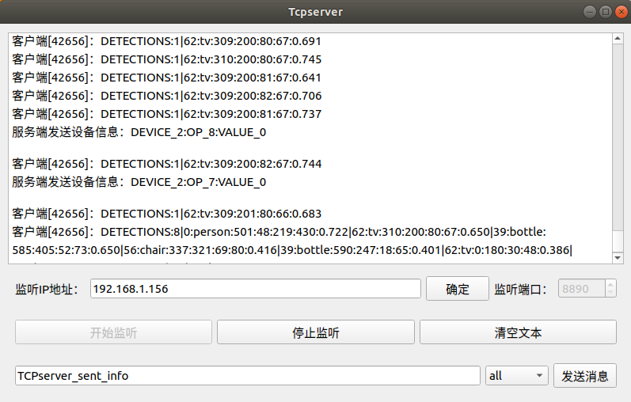

</div>

### 📡 UDP设备自动发现
- **局域网扫描**: 基于UDP广播协议，自动扫描局域网内的在线摄像头设备
- **状态监控**: 实时监控设备心跳，并在UI中直观更新设备的在线/离线状态
- **一键连接**: 双击或选中设备后点击连接，一键下发TCP连接请求建立通信
- **信息解析**: 自动解析并展示设备的名称、IP、RTSP地址和设备型号等信息

<div align="center">

<p><b>UDP广播界面</b></p>
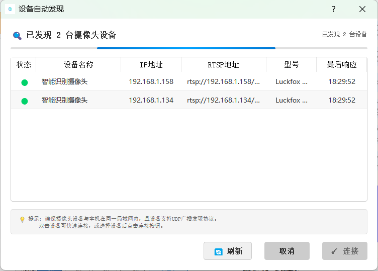

</div>

### 🤖 AI识别
- **YOLOv5支持**: 标准COCO数据集80类对象识别
- **实时检测**: 视频流中的目标检测
- **结果显示**: 检测框和置信度显示

<div align="center">

<p><b>全局识别界面</b></p>
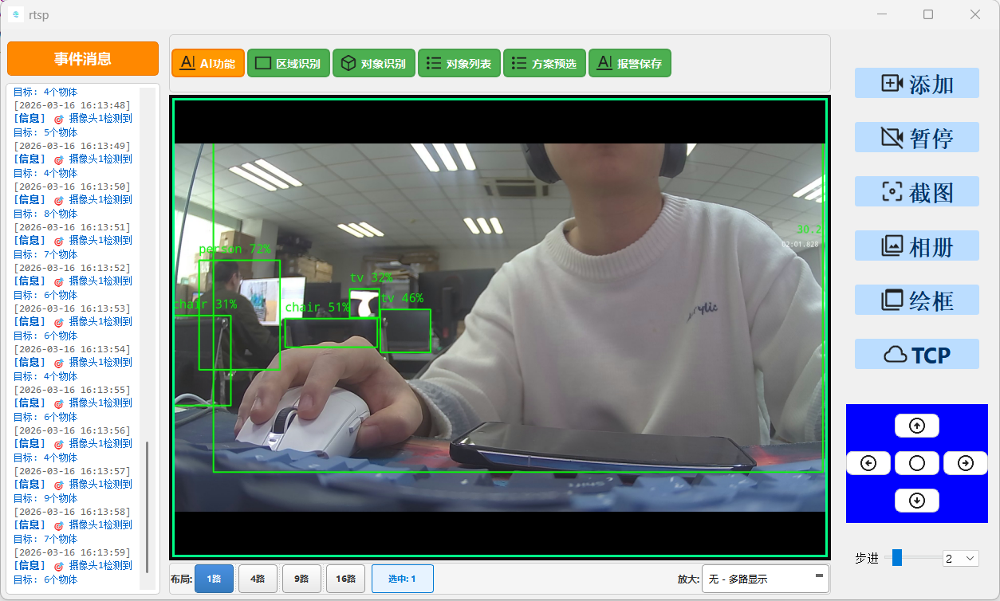

</div>

### 🎯 区域识别
- **区域识别**: 支持指定方框内的区域识别，过滤方框外的信息
- **鼠标绘制**: 支持通过鼠标拖拽绘制矩形框
- **实时预览**: 绘制过程中实时显示矩形框轮廓和尺寸
- **尺寸显示**: 显示矩形框的宽度和高度信息

<div align="center">

<p><b>区域识别界面</b></p>
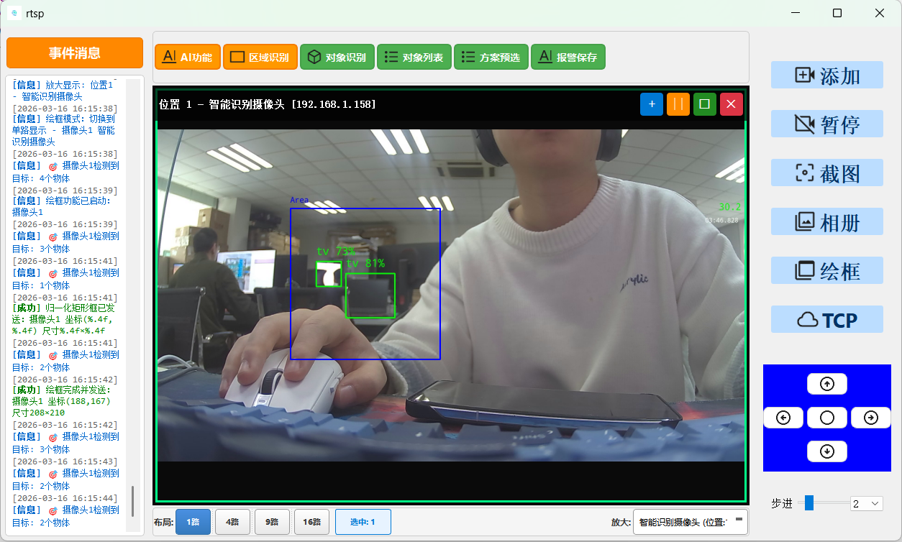

</div>

### 🔍 物体识别
- **物体识别**: 支持识别指定coco数据集内的类别，可单选或者多选
- **智能搜索**: 实时搜索高亮匹配对象
- **批量操作**: 全选/清空/搜索功能
- **选择统计**: 实时显示已选择数量

<div align="center">

<p><b>物体识别展示</b></p>
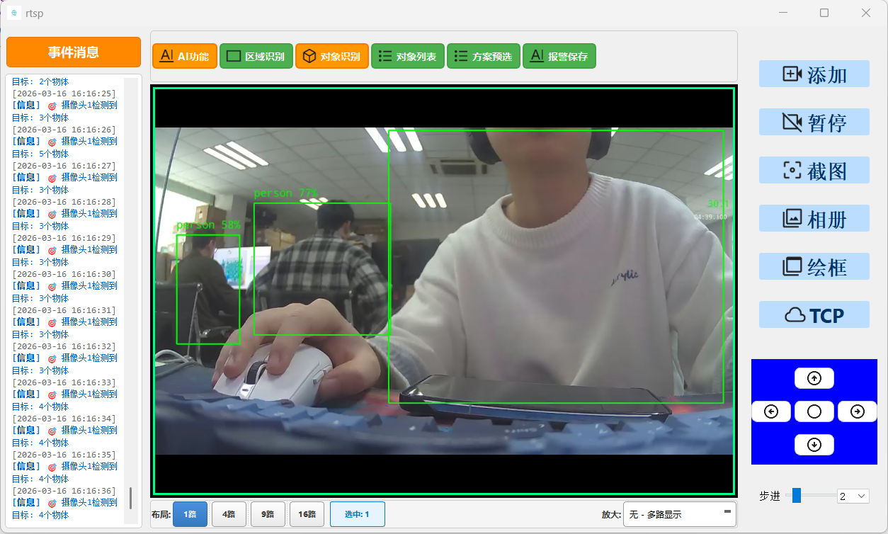

<br>
<p><b>物体选择界面</b></p>
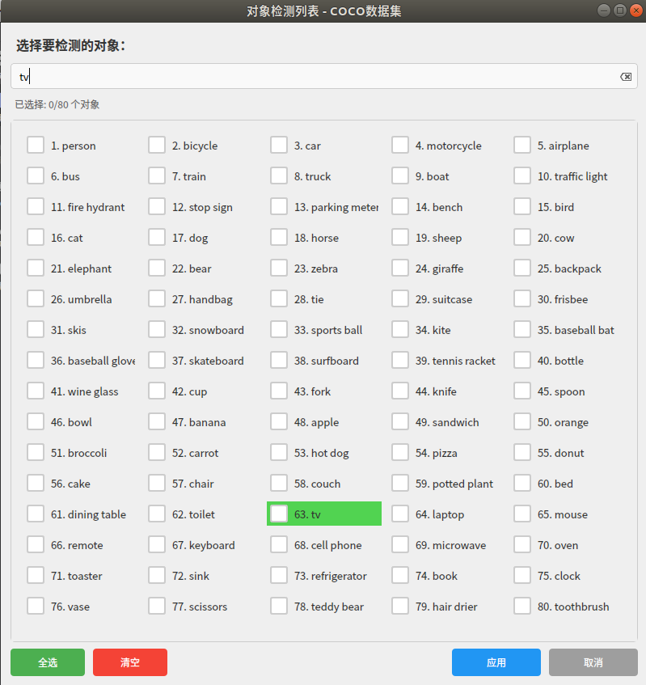

</div>

### 📸 相册
- **双相册系统**: 截图相册与报警相册独立管理，支持无缝切换查看
- **时间排序**: 支持按图片生成时间进行快速的升序或降序排列
- **设备筛选**: 提供下拉框快速过滤并归类由指定摄像头产生的图片
- **交互体验**: 支持鼠标滚轮动态缩放（0.2x-3.0x）与上下翻页查看
- **文件操作**: 支持通过滑动条和输入框精确定位跳转，以及从本地直接删除图片

<div align="center">

<p><b>相册界面</b></p>
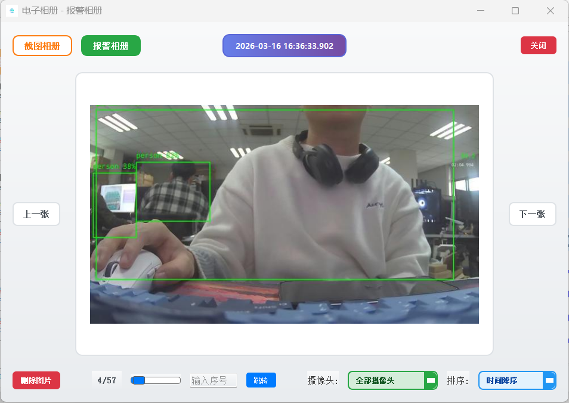

</div>

### 🎮 舵机云台
- **四向控制**: 上下左右自由转动 + 复位功能
- **步进设置**: 滑动条与下拉框设置舵机步进值
- **TCP指令**: 通过网络发送舵机控制指令

<div align="center">

<p><b>舵机操作布局展示</b></p>
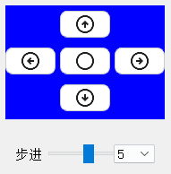

</div>

### 📋 方案预选
- **SQLite数据库**: 本地化存储方案配置
- **一键配置**: 预设完整的监控方案，一键应用所有配置
- **方案管理**: 可创建、保存、编辑、删除多个监控方案

<div align="center">

<p><b>方案预选展示</b></p>
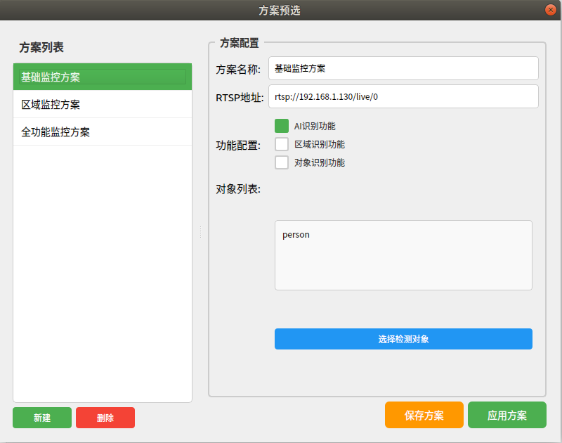

</div>

---

## 🛠️ 开发环境
| 组件 | 版本 | 说明 |
|------|------|------|
| **运行平台** | Qt Creator 4.12.2 | 集成开发环境 |
| **构建套件** | Qt 5.12.9 (MinGW 64bit) | UI框架与编译工具链 |
| **音视频库** | FFmpeg Latest | 音视频处理库文件 |
| **操作系统** | Linux | 目标运行平台 |

---

## 📚 使用教程

### 🔧 环境配置

#### 1️⃣ 安装Qt 5.12.9

在Linux环境下安装Qt 5.12.9开发环境：

```bash
# 下载Qt 5.12.9安装包
wget https://download.qt.io/archive/qt/5.12/5.12.9/qt-opensource-linux-x64-5.12.9.run

# 给安装包执行权限
chmod +x qt-opensource-linux-x64-5.12.9.run

# 运行安装程序
./qt-opensource-linux-x64-5.12.9.run
```

> 💡 **提示**: 安装过程中请选择Qt Creator和MinGW编译器

#### 2️⃣ 安装FFmpeg库文件

更新系统包列表并安装FFmpeg：

```bash
# 更新包列表
sudo apt update

# 安装FFmpeg及其开发库
sudo apt install ffmpeg libavcodec-dev libavformat-dev libavutil-dev libswscale-dev
```

#### 3️⃣ 查找库文件安装路径

使用以下命令查找FFmpeg库文件的安装路径：

```bash
# 查找avcodec库路径
/sbin/ldconfig -p | grep avcodec

# 查找avformat库路径
/sbin/ldconfig -p | grep avformat

# 查找avutil库路径
/sbin/ldconfig -p | grep avutil

# 查找swscale库路径
/sbin/ldconfig -p | grep swscale
```

**示例输出**:
```
libavcodec.so.58 (libc6,x86-64) => /usr/lib/x86_64-linux-gnu/libavcodec.so.58
libavformat.so.58 (libc6,x86-64) => /usr/lib/x86_64-linux-gnu/libavformat.so.58
libavutil.so.56 (libc6,x86-64) => /usr/lib/x86_64-linux-gnu/libavutil.so.56
libswscale.so.5 (libc6,x86-64) => /usr/lib/x86_64-linux-gnu/libswscale.so.5
```

#### 4️⃣ 配置Qt项目文件

打开`rtsp.pro`文件，找到`# FFmpeg 库文件路径`注释部分，替换为实际的库文件路径：

```pro
# FFmpeg 库文件路径 (根据步骤3查找到的路径进行配置)
LIBS += -L/usr/lib/x86_64-linux-gnu/ -lavcodec -lavformat -lavutil -lswscale

# FFmpeg 头文件路径
INCLUDEPATH += /usr/include/x86_64-linux-gnu
INCLUDEPATH += /usr/include
```

#### 5️⃣  启动应用程序

1. **编译项目**: 在Qt Creator中打开项目并编译
2. **运行程序**: 点击运行按钮启动应用
3. **选择配置方式**:

##### 方式一：手动添加摄像头
1. 点击"添加视频"按钮
2. 输入RTSP地址: `rtsp://RV1106地址/live/0`
3. 点击确认开始视频流播放

##### 方式二：使用方案预设
1. 点击"方案预选"按钮
2. 选择预设的监控方案
3. 点击"应用方案"一键配置

##### 方式三：UDP广播自动发现（推荐）
1. 确保PC服务器网络正常并启动程序
2. PC自动开始广播UDP发现消息
3. 客户端设备启动后自动收到广播
4. 客户端自动连接到PC并建立TCP连接
5. PC自动绑定已添加的摄像头到客户端IP
6. 摄像头绑定成功，即可通信

> 🔗 **RTSP地址格式**: `rtsp://192.168.1.100/live/0`  
> 其中`192.168.1.100`为RV1106设备的实际IP地址

---

## 📈 性能测试

本项目在 **RK3576** 平台上进行了多路连续视频流（分辨率：`1920x1080`）的软硬件解码性能对比测试，充分验证了硬件加速对系统底层计算资源的解放能力。

### 💻 FFmpeg 软解模式（仅依赖 CPU）
- **8路视频流软解**：系统 CPU 占用率达 **80%**，程序仍能正常运行，但系统产生较大负荷。
- **10路视频流软解**：系统出现明显卡顿，CPU 占用率达到 **100% 极限满载**，不再满足流畅监控的需求。

<div align="center">

<p><b>8路软解性能图 (CPU占用约80%)</b></p>
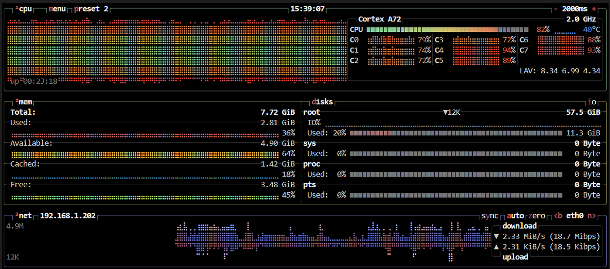

<br>
<p><b>10路软解性能图 (CPU满载卡顿)</b></p>
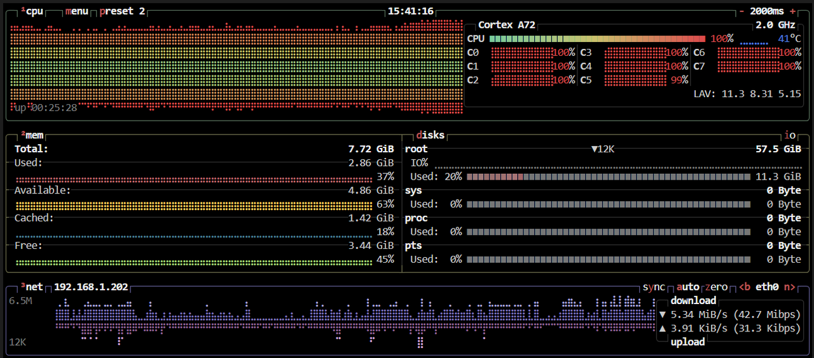

</div>

### ⚡ MPP+RGA 硬解模式（芯片硬件加速）
- **8路视频流硬解**：系统 CPU 占用率急剧下降，仅维持在 **36%** 左右，画面极为流畅丝滑。
- **16路视频流硬解**：在挑战极限的 **16 路全画幅高并发**压力下，CPU 占用率仅微升至 **45%**，系统依然轻松胜任、毫无卡顿，完美展现了当前架构在嵌入式平台上的性能统治力。

<div align="center">

<p><b>8路硬解性能图 (CPU占用仅36%)</b></p>
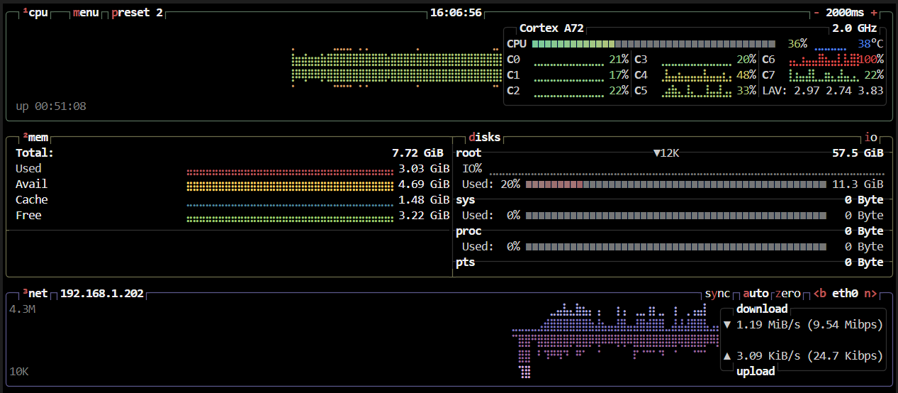

<br>
<p><b>16路硬解性能图 (满载16路流畅运行)</b></p>
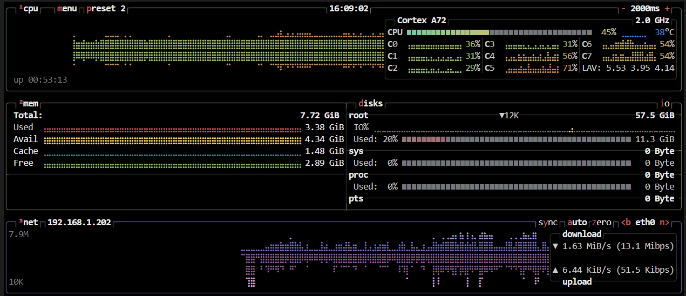

</div>


---
## 🏗️ 框架设计

### 📊 MVC架构模式
项目采用经典的MVC（Model-View-Controller）架构模式，实现了良好的代码分层和职责分离：

#### 🗃️ Model层 (数据模型层)
- **model.cpp/h**: 视频流数据处理模型
  - RTSP流解码和处理
  - FFmpeg集成和多线程管理
  - 视频帧数据转换和输出
  
- **plan.cpp/h**: 方案预选数据模型
  - SQLite数据库操作
  - 方案配置的CRUD操作
  - 数据持久化管理

#### 🖼️ View层 (视图展示层)
- **mainwindow.ui/cpp/h**: 主界面视图
  - 整体布局和界面组织
  - 各功能模块的视图集成
  
- **Picture.cpp/h**: 相册视图组件
  - 图片浏览和管理界面
  - 双相册系统展示
  
- **VideoLabel.cpp/h**: 自定义视频显示组件
  - 视频流显示控件
  - 交互式矩形框绘制界面
  
- **detectlist.cpp/h**: 对象选择视图
  - COCO数据集对象列表界面
  - 搜索和批量操作界面

- **DeviceDiscoveryDialog.cpp/h**: 设备发现对话框
  - UDP设备扫描界面
  - 设备列表展示
  - 一键连接功能

#### 🎮 Controller层 (控制逻辑层)
- **controller.cpp/h**: 主控制器
  - 业务逻辑协调和控制
  - 各模块间的通信协调
  - 事件处理和响应管理
  
- **Tcpserver.cpp/h**: TCP通信控制器
  - 网络通信控制逻辑
  - 客户端连接管理
  - 数据协议解析和处理

- **DeviceDiscovery.cpp/h**: 设备发现管理器
  - UDP广播发现机制
  - 自动IP-摄像头绑定
  - 设备列表维护

---

## 📁 项目结构
```
rtsp/
├── 📂 src/                      # 源代码目录（MVC架构）
│   ├── main.cpp                 # 程序入口
│   │
│   ├── 📂 model/                # Model层 - 数据模型
│   │   ├── model.cpp/h          # 视频流数据处理模型
│   │   ├── FFmpegDecoder.cpp/h  # FFmpeg 软件解码实现
│   │   ├── MppDecoder.cpp/h     # MPP 硬件解码实现
│   │   ├── IVideoDecoder.h      # 解码器接口（抽象类）
│   │   └── common.h             # 公共头文件和宏定义
│   │
│   ├── 📂 view/                 # View层 - 视图界面
│   │   ├── mainwindow.cpp/h/ui  # 主窗口界面
│   │   ├── Picture.cpp/h        # 相册浏览组件
│   │   ├── VideoLabel.cpp/h     # 自定义视频显示控件
│   │   ├── detectlist.cpp/h     # 对象选择列表组件
│   │   ├── AddCameraDialog.cpp/h # 添加摄像头对话框
│   │   ├── DeviceDiscoveryDialog.cpp/h # 设备发现对话框
│   │   ├── plan.cpp/h           # 方案预选管理界面
│   │   └── view.cpp/h           # 视图基类
│   │
│   └── 📂 controller/           # Controller层 - 控制器
│       ├── controller.cpp/h     # MVC主控制器
│       ├── Tcpserver.cpp/h      # TCP服务器控制器
│       └── DeviceDiscovery.cpp/h # 设备发现管理器(UDP广播、自动绑定)
│
├── 📂 build/                    # 编译输出目录
│
├── 🎨 资源文件
│   ├── icon.qrc                 # 图标资源文件
│   ├── 📂 icon/                 # UI界面图标目录
│   └── 📂 picture/              # 本地数据存储目录
│       ├── save-picture/        # 截图相册存储
│       └── alarm-picture/       # 报警相册存储
│
├── ⚙️ 配置文件
│   ├── rtsp.pro                 # Qt项目配置文件
│   └── .gitignore               # Git忽略配置
│
└── 📖 文档
    ├── README.md                # 项目主说明文档
    ├── MODEL_DATAFLOW.md        # 硬件加速与数据流解析文档
    └── 📂 readme-picture/       # README展示配图目录
```

### 🎯 关键设计模式

#### 👀 观察者模式
- 使用Qt信号槽机制实现组件间解耦
- Model层数据变化自动通知View层更新

#### 🏷️ 单例模式
- Controller作为系统唯一控制中心
- 确保各模块协调统一

#### 🏭 工厂模式
- 统一的组件创建和初始化流程
- 便于扩展新的功能模块

#### 📋 策略模式
- 方案预选功能采用策略模式
- 不同监控场景对应不同配置策略

---

## 🚀 应用场景

- 🏭 **智能监控**: 工业现场实时监控和目标检测
- 🏠 **安防系统**: 家庭/办公室安防监控
- 🤖 **机器视觉**: 自动化生产线质量检测
- 📊 **数据采集**: 视觉数据收集和分析

---

### ✨ 功能特色总结

| 🎯 功能模块 | 🔧 核心特性 | 📊 应用场景 |
|------------|------------|------------|
| **🤖 AI识别** | YOLOv5实时检测 | 智能监控、目标跟踪 |
| **📐 区域识别** | 自定义检测区域 | 禁区监控、区域安防 |
| **🔖 物体识别** | 80类COCO对象 | 特定目标监测 |
| **📋 方案预选** | 一键配置切换 | 多场景快速部署 |
| **📸 相册管理** | 双相册系统 | 图片分类存储 |
| **🌐 TCP通信** | 多客户端支持 | 设备集中控制 |
| **📡 UDP广播** | 自动发现+自动绑定 | 零配置部署 |
| **⚡ RK3576硬件加速** | MPP硬解/RGA转码/硬件渲染 | 边缘端部署 |
| **🛠️ 跨平台编译** | 兼容Win/Linux与x86/ARM架构 | 可移植性高 |

> 💡 **提示**: 点击图片可查看更清晰的效果展示

---

### 📧 技术支持

如有任何技术问题或建议，欢迎通过邮箱与我联系：

📮 **联系邮箱**: [13883124164@163.com](mailto:13883124164@163.com)

---

## 📄 许可证

本项目采用 MIT 许可证 - 查看 [LICENSE](LICENSE) 文件了解详情。

---

<div align="center">
<b>⭐ 如果这个项目对你有帮助，请给它一个星标！</b>
</div>
